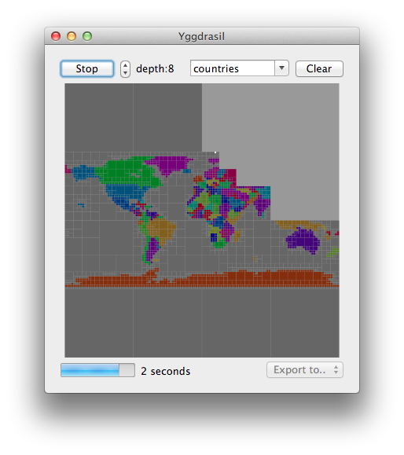

Yggdrasil
===========

*Objective-C quadtree implementation with OS X visualization app.*

About
-----
Yggdrasil turns a simple 2D mapping into a quad tree by recursively sampling coordinates. It can be used for generating a fast lookup for geographical data based on a slow lookups like polygon intersection or even web requests.

Labeler
-------
Yggdrasil builds up its quadtree by sampling labels from a *labeler*. A labeler provides a mapping from 2D coordinates to string labels. All labelers implement the `YGLabeler` protocol, which includes the method:

    - (void)labelAtPoint:(NSPoint)point block:(void (^)(NSString *))block;

The `NSPoint` parameter is contained in the rectangle returned by `- (NSRect)rect`. The callback block allows for asynchronous lookup, for example to fetch labels from a web server.

Drawing
-------
When selecting a labeler, the last fully scanned quadtree is displayed. After starting a scan, progress is indicated by frequent updates and the display of a white square cursor. Zoom in by clicking one of the four quadrants, zoom out by clicking on the side. The tree is only drawn up to screen resolution, so use zooming to appreciate the details. Resize the window to have the cursor update more frequently.

Exporting
---------
A generated quadtree can be saved to a file. Yggdrasil supports tree formats: plain, text, binary. To demonstrate the layout of the formats, let's assume the tree pictured below. Element are ordered left to right, bottom to top.

    +---+---+-------+
    | C | D |       |
    +---+---+       |
    | B |   |       |
    +---+---+-------+
    |       |       |
    |       |   A   |
    |       |       |
    +-------+-------+

Plain is a basic, inefficient, but easy to read format. Each node is encoded in the form `[,,,]`. In this particular case this results in:

    [,A,[B,,C,D],]

The text format provides a more efficient storage, while retaining readability. It starts by listing the number of labels and the label strings. This is followed by the tree encoded in plain format, but with labels replace by their index:

    4,8,C,B,D,A,[,4,[2,,1,3],]

The binary format is the most efficient in terms of size and read time. It is similar to the text format, but uses a byte-aligned encoding, with one byte per node and 1 or 2 bytes per index.

Caching
-------
All sampled labels are stored in a cache file to allow fast reruns of the same labeler. This cache is stored in `~/Caches/Yggdrasil` with a `.cache` extension. If you modifiy a labeler, its important to clear this cache. Fortunately there's a button for that.
    

Demo
----
To get an idea of how to use a generated quad tree, take a look at the demo lookups written in Objective-C, C and Ruby. Each demo is fully self-contained and demonstrates a different tree data format.
    
The geo data included in these demos is of low accuracy. If you're looking for more details, then use the `countries-12.ygg` file located in the `Demo` folder. This tree was generated using a 11 MB GeoJSON file. The tree has a maximum depth of 12, minimum 10 and subsample 2. It took about 4 hours of scanning on a 2 GHz Core i7 and resulted in a 130 MB cache file. The result is 630 KB, or 100 KB gzipped, with an accuracy of 10 km around the equator (40,000 / 2^12).

Geodata
-------
The `YGGeoJsonLabeler` class can be used with the file `countries.json`, which is included in this project. This file contains [GeoJSON](http://www.geojson.org/geojson-spec.html) data that was downloaded from [github.com/johan/world.geo.json](https://github.com/johan/world.geo.json).

More geo data can be found here:

* [www.diva-gis.org](http://www.diva-gis.org/Data)
* [www.gadm.org](http://www.gadm.org/)
* [www.unsalb.org](http://www.unsalb.org/)
* [www.thematicmapping.org](http://thematicmapping.org/downloads/world_borders.php)
* [www.mappinghacks.com](http://www.mappinghacks.com/data/)
* [www.geonames.org](http://download.geonames.org/export/dump/)

Use [GDAL](http://www.gdal.org/) to convert formats. On OS X this can be installed with [Homebrew](http://mxcl.github.com/homebrew/). Example usage:

    ogr2ogr -f GeoJSON countries.json countries.shp

License
-------
Yggdrasil is licensed under the terms of the BSD 2-Clause License, see the included LICENSE file.

Authors
-------
- [Leonard van Driel](http://www.leonardvandriel.nl/)
